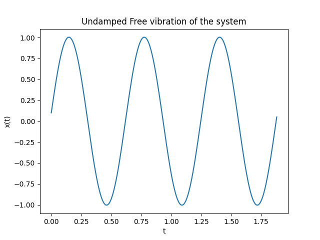
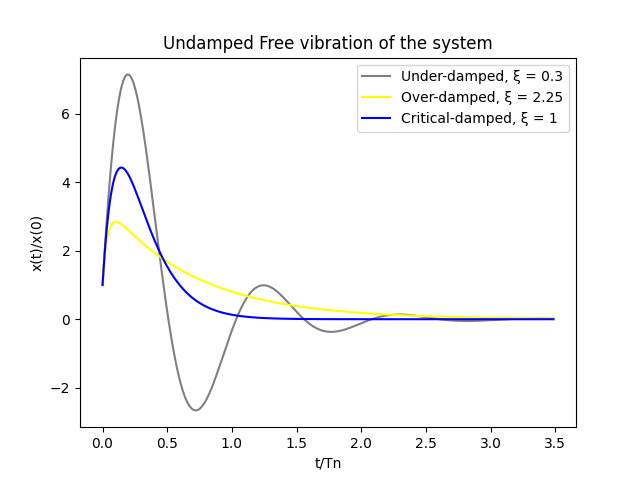

# Given Information

m = 10 kg \
k = 1000 N/m \
x(0) = 0.1 m,
$\hat{x}$(0) = 10 m/s 

# Problem

1. Plot the undamped free vibration responce of the system.
2. Plot the damped free vibration of the system considering under-damped, critical damped and over-damped conditions.

# Solution of part - 1
```math
x(t) = x(0)cos(w_nt) + (\hat{x}(0) \div w_n)sin(w_nt)
```
where,

```math
w_n = \sqrt{k/m}
```

$w_n$ = 10 $s^{-1}$




Calculation and plotting is done in Part_a.py file.

# Solution of Part - 2

$c_{cr}$ = $2\sqrt{km}$

in this question, \
<b> $c_{cr}$ = 200 Nm/s </b> \
<b> $w_n$ = 10 $s^{-1}$ </b>

1. <b>For Under-damped condition:-</b>

c < $c_{cr}$ \
Let take c = 60 Nm/s

The equation is,

```math
x(t) = c_1e^{-ct/2m}cos(w_dt) + c_2e^{-ct/2m}sin(w_dt)
```
where, 

```math
w_d = w_n\sqrt{1-ξ^2}
```
```math
ξ = c / c_{cr}
```

Now,  
ξ = 0.3 \
w_d = 9.54 $s^{-1}$

x(0) = $c_1$ = 0.1 \
$\hat{x}$(0) = 10 \
so,  
$c_2$ = 1.08


2. <b>For Over damped condition:- </b>

c > $c_{cr}$ \
Let take c = 450 Nm/s

The equation is,

```math
x(t) = c_1e^{r_1t} + c_2e^{r_2t}
```
where, 

```math
r_1 = w_n(-ξ + \sqrt{ξ^2 - 1}) 
```
```math
r_2 = w_n(-ξ - \sqrt{ξ^2 - 1})
```
```math
ξ = c / c_{cr}
```

Now,  
ξ = 2.25  
$r_1$ = -2.34  
$r_2$ = -42.65

x(0) = 0.1  
$\hat{x}$(0) = 10

Solving above two equation gives,  
$c_1$ = 0.35  
$c_2$ = -0.25

3. <b>For Critical condition:- </b>

c = $c_{cr}$ \
ξ = 1  
So, c = 200 Nm/s

The equation is,

```math
x(t) = e^{-w_nt}(c_1 + c_2t)
```

Now,  
ξ = 1

x(0) = 0.1  
$\hat{x}$(0) = 10

Solving above two equation gives,  
$c_1$ = 0.1  
$c_2$ = 11



Calculation and plotting is done in Part_b.py