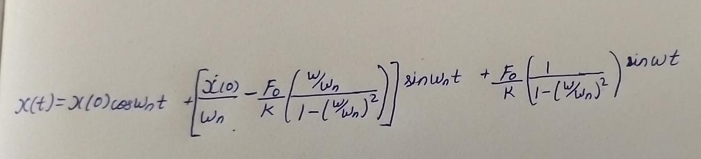
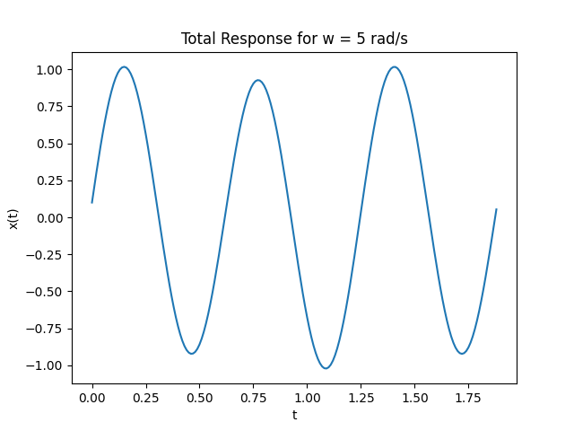
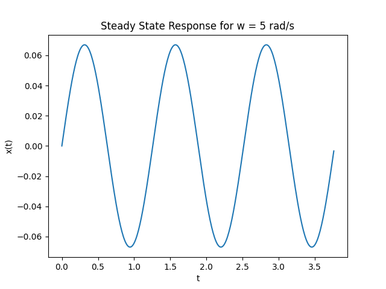
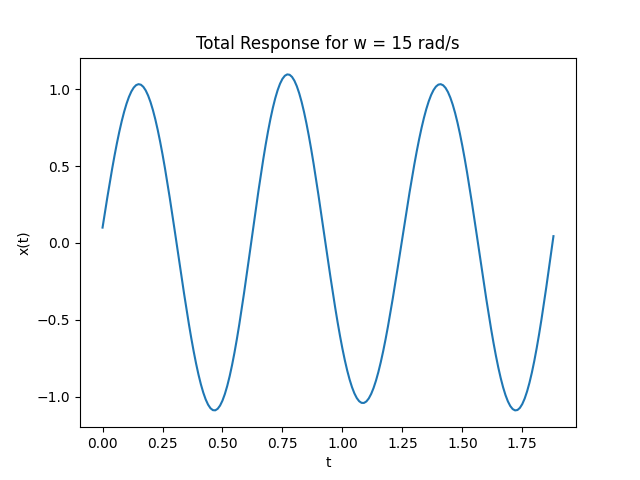
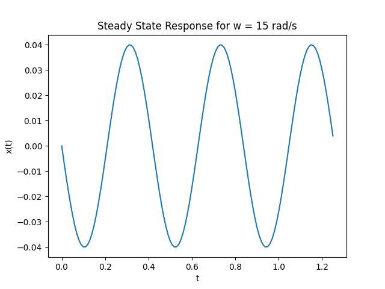

# Question

An undamped system has,  
m = 10 kg,  
k = 1000 N/m,  
If the system is subjected to initial displacement and velocity of 0.1 m and 10 m/s respectively, and it is excited by a sinusoidal harmonic force having an amplitude $F_0$ = 50 N.

1) Plot the system's total and steady-state response (separately) for excitation frequencies of ω = 5 rad/s
and 15 rad/s.  
2) For both the frequency values, determine (i) the frequency ratio 𝞫, (ii) the amplitude of the forced response $X_p$, (iii) the magnification factor $R_d$ and (iv) phase angle ϕ .

# Solution

#### Given Information
m = 10 Kg  
k = 1000 N/m  
x(0) = 0.1 m  
$\hat{x}$(0) = 10 m/s  
F = 50sin(wt)

## Part 1


```math
w_n = \sqrt{k/m}
```

$w_n$ = 10 $s^{-1}$

### For w = 5 rad/s  

x(t) = 0.1cos(10t) + 0.967sin(10t) + 0.067sin(5t)

so,  
#### Total response -> x(t) = 0.1cos(10t) + 0.967sin(10t) + 0.067sin(5t)



#### Steady State response -> x(t) = 0.067sin(5t)



### For w = 15 rad/s  

x(t) = 0.1cos(10t) + 1.06sin(10t) - 0.04sin(15t)

so,  
#### Total response -> x(t) = 0.1cos(10t) + 1.06sin(10t) - 0.04sin(15t)



#### Steady State response -> x(t) = - 0.04sin(15t)



## Part 2

𝞫 = w / $w_n$  
$X_p$ = $X_{st}$ / (1 - $𝞫^2$ )  
$X_{st}$ = $F_0$ / k  
$R_d$ = 1 / |1 - $𝞫^2$ |  

### For w = 5 rad/s
𝞫 = 0.5  
$X_{st}$ = 0.05  
$X_p$ = 0.066  
$R_d$ = 1.33  
ϕ = $0^o$  

### For w = 15 rad/s
𝞫 = 1.5  
$X_{st}$ = 0.05  
$X_p$ = 0.04  
$R_d$ = 0.8  
ϕ = $180^o$  