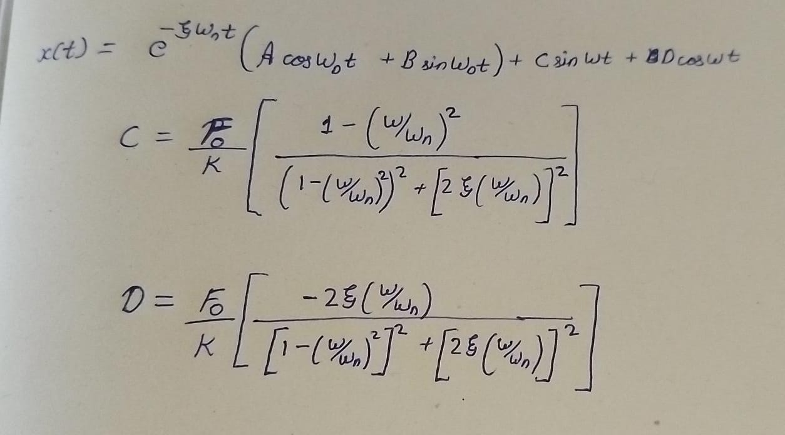
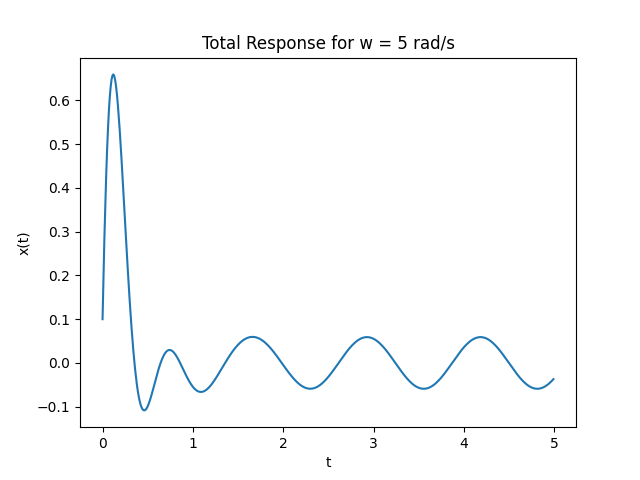
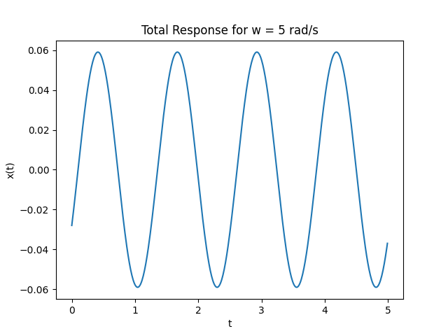
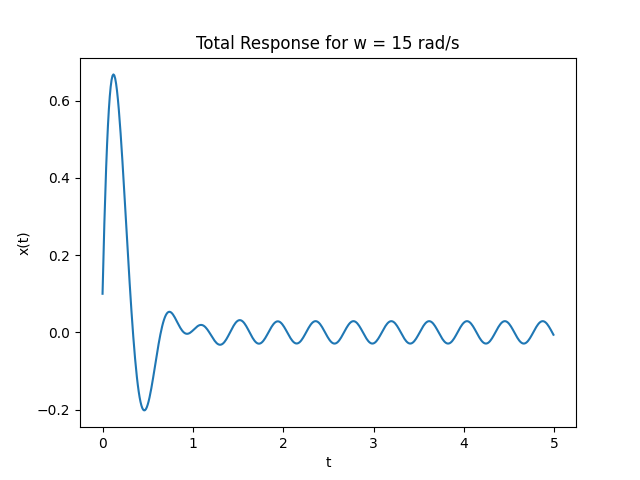
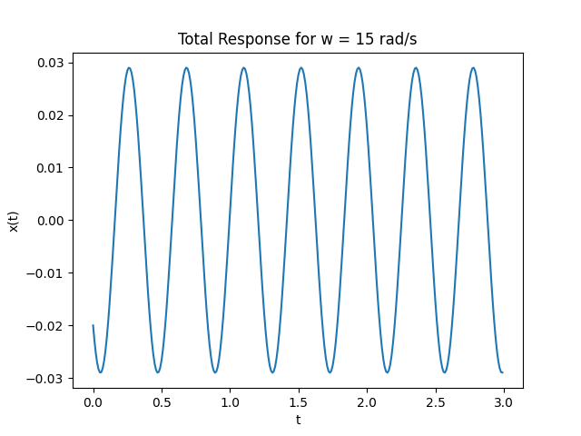

# Question 2

If the same system given in Question 1 has a damping of c = 80 Ns/m,

1) Plot the total and steady-state damped response for excitation frequencies of ω = 5 rad/s and 15 rad/s.

2) Determine (i) the amplitude of the forced response $X_p$, (ii) the magnification factor $R_d$ and (iii) phase angle ϕ the damped system for both the forcing frequencies.

# Solution

#### Given Information
m = 10 Kg  
k = 1000 N/m  
x(0) = 0.1 m  
$\hat{x}$(0) = 10 m/s  
F = 50sin(wt)
c = 80 Ns/m  

## Part 1


```math
w_n = \sqrt{k/m}
```

```math
ξ = c / (2\sqrt{km})
```

```math
W_D = w_n\sqrt{1-ξ^2}
```

ξ = 0.4  
$w_n$ = 10 $s^{-1}$  
$W_D$ = 9.16 $s^{-1}$  

### For w = 5 rad/s

C = 0.052  
D = -0.028  

```math
x(t) = e^{-4t}[Acos(9.16t) + Bsin(9.16t)] + 0.052sin(5t) -0.028cos(5t)
```
```math
\hat{x}(t) = -4e^{-4t}[Acos(9.16t) + Bsin(9.16t)] + e^{-4t}[-9.16Asin(9.16t) + 9.16Bcos(9.16t)] + 0.26cos(5t) + 0.14sin(5t)
```

x(0) = A - 0.028 = 0.1  
A = 0.128  
$\hat{x}$(0) = -4A + 9.16B + 0.26 = 10  
B = 1.12

```math
x(t) = e^{-4t}[0.128cos(9.16t) + 1.12sin(9.16t)] + 0.052sin(5t) - 0.028cos(5t)
```
so,  
#### Total response -> 
```math
x(t) = e^{-4t}[0.128cos(9.16t) + 1.12sin(9.16t)] + 0.052sin(5t) - 0.028cos(5t)
```



#### Steady State response -> x(t) = 0.052sin(5t) - 0.028cos(5t)




### For w = 15 rad/s

C = - 0.021  
D = - 0.02  

```math
x(t) = e^{-4t}[Acos(9.16t) + Bsin(9.16t)] - 0.021sin(15t) - 0.02cos(15t)
```
```math
\hat{x}(t) = -4e^{-4t}[Acos(9.16t) + Bsin(9.16t)] + e^{-4t}[-9.16Asin(9.16t) + 9.16Bcos(9.16t)] - 0.315cos(15t) + 0.3sin(15t)
```

x(0) = A - 0.02 = 0.1  
A = 0.12  
$\hat{x}$(0) = -4A + 9.16B - 0.315 = 10  
B = 1.18

```math
x(t) = e^{-4t}[0.12cos(9.16t) + 1.18sin(9.16t)] - 0.021sin(15t) - 0.02cos(15t)
```
so,  
#### Total response -> 
```math
x(t) = e^{-4t}[0.12cos(9.16t) + 1.18sin(9.16t)] - 0.021sin(15t) - 0.02cos(15t)
```



#### Steady State response -> x(t) = - 0.021sin(15t) - 0.02cos(15t)



## Part 2

𝞫 = w/$w_n$  
ξ = 0.4  
$X_{st}$ = $F_0$ / k  
$$ X_p = X_{st} \cdot \frac{1}{\sqrt{(1-\beta)^2 + (2\xi \beta)^2}} $$  
$R_d$ = $X_p$ / $X_{st}$  
ϕ = $tan^{-1}$(-D/C)  

### For w = 5 rad/s
𝞫 = 0.5  
$X_{st}$ = 0.05  
$X_p$ = 0.078  
$R_d$ = 1.56  
ϕ = $28.30^o$  

### For w = 15 rad/s
𝞫 = 1.5  
$X_{st}$ = 0.05  
$X_p$ =  0.0385  
$R_d$ = 0.77  
ϕ = $-43.60^o$  