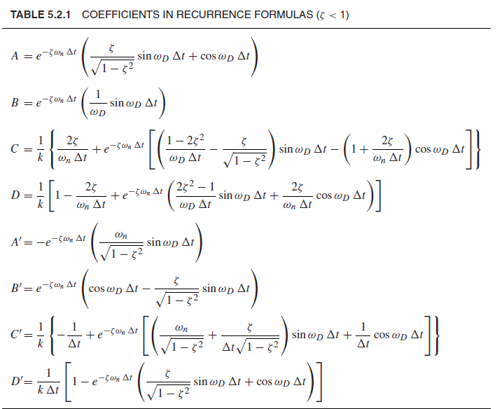
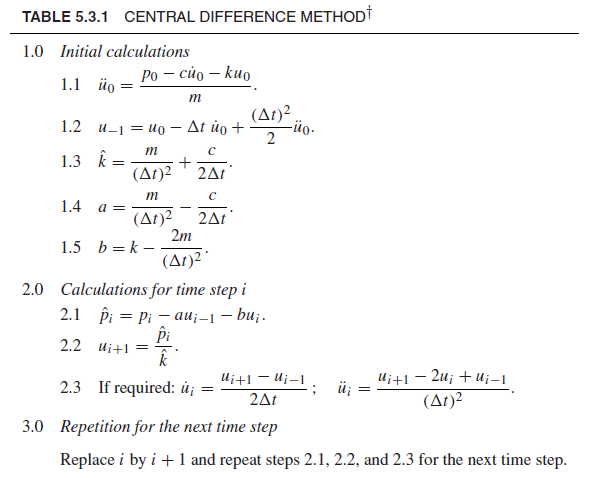
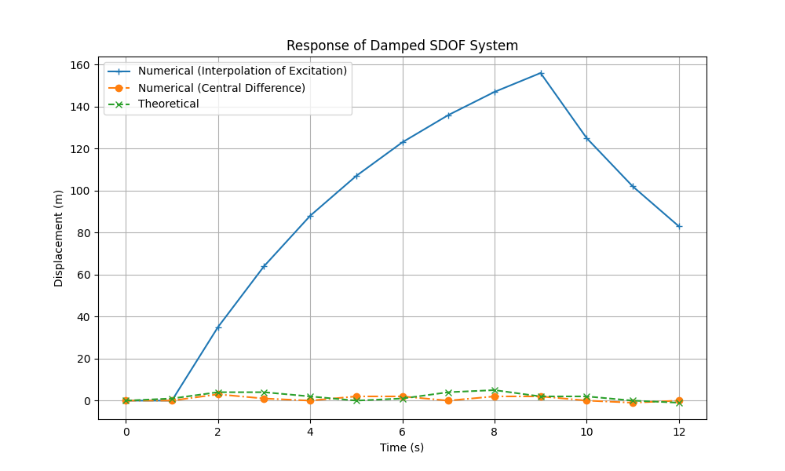

# Question 3

Find the response of a damped SDOF system using the Interpolation of excitation and Central difference method with 500 kg mass, 200 Ns/m damping and 750 N/m spring stiffness for a rectangular pulse force of $F_o$ = 2000 N and $t_d$ = 9 sec. Compare the response with the theoretical response for up to t = 12 sec. Use Δt = 1sec.

# Solution

m = 500 kg  
c = 200 Ns/m  
k = 750 N/m  
$F_0$ = 2000 N  
$t_d$ = 9 sec  
Δt = 1 sec  
t = 12 sec  

$w_n$ = $\sqrt{k/m}$ = 1.22  
ξ = $\frac{c}{2\sqrt{km}}$ = 0.163  
$w_d$ = $w_n$ * $\sqrt{1 - ξ^2}$ = 1.20  

## Interpolation of Excitation Method Response


```math
x_{i+1} = Ax_i + B\hat{x_i} + CF_i + DF_{i+1}
```
```math
\hat{x}_{i+1} = A'x_i + B'\hat{x_i} + C'F_i + D'F_{i+1}
```
A = 0.42  
B = 0.63  
C = 0.0005  
D = 0.0003  
A' = -0.94   
B' = 0.168  
C' = 0.0005  
D' = 0.0008  

## Central Difference Method Response
  
$\hat{\hat{x_0}}$ (acceleration) = 4  
$u_{-1}$ = 2  
$\hat{k}$ = 600  
a = 400  
b = -250  

#### Initial Condition
$x_0$ = 0  
$\hat{x_0}$ = 0  

## Theoretical Response

if t < $t_d$ :

$$ x^s(t) = \frac{F_0}{k} [1- e^{-\zeta\omega_nt}(cos\omega_dt + \frac{\zeta}{\sqrt{1-\zeta^2}}sin\omega_dt)] $$

if t > $t_d$ :

$$ x(t) = e^{\frac{-c(t-t_d)}{2m}}[x^s(t_d)cos\omega_d(t-t_d) + \frac{1}{\omega_d}(\hat{x^s}(t_d) + \frac{c*x^s(t_d)}{2m})\cdot sin\omega_d(t-t_d)] $$

```math
\hat{x^s}(t_d) = \frac{F_0}{k} \cdot \frac{e^{-\zeta\omega_nt_d}*\omega_d*sin(\omega_dt_d)}{1 - \zeta^2} = -5.392
```


