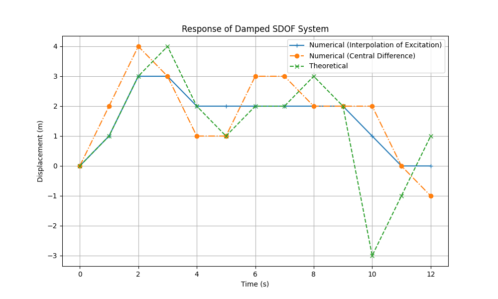

# Question 3

Find the response of a damped SDOF system using the Interpolation of excitation and Central difference method with 500 kg mass, 200 Ns/m damping and 750 N/m spring stiffness for a rectangular pulse force of $F_o$ = 2000 N and $t_d$ = 9 sec. Compare the response with the theoretical response for up to t = 12 sec. Use Δt = 1sec.

# Solution

m = 500 kg  
c = 200 Ns/m  
k = 750 N/m  
$F_0$ = 2000 N  
$t_d$ = 9 sec  
Δt = 1 sec  
t = 12 sec  

$w_n$ = $\sqrt{k/m}$ = 1.22  
ξ = $\frac{c}{2\sqrt{km}}$ = 0.163  

## Central Difference Method Response
```math
x_{i+1} = \frac{F_i \cdot \Delta t^2}{m} + 2 x_i - x_{i-1} - \frac{c \Delta t}{m}(x_i - x_{i-1}) - \frac{k \Delta t^2}{m} x_i 
```

#### Initial Condition
$x_0$ = 0  
$\hat{x_0}$ = 0  

## Theoretical Response

if t < $t_d$ :

$$ x^s(t) = \frac{F_0}{k}(1-cos\omega_nt) = 2.67(1-cos1.22t) $$

if t > $t_d$ :

$$ x(t) = \frac{F_0}{k}[cos\omega_n(t-t_d) - cos\omega_nt] = 2.67(cos1.22(t-9) - cos1.22t) $$


